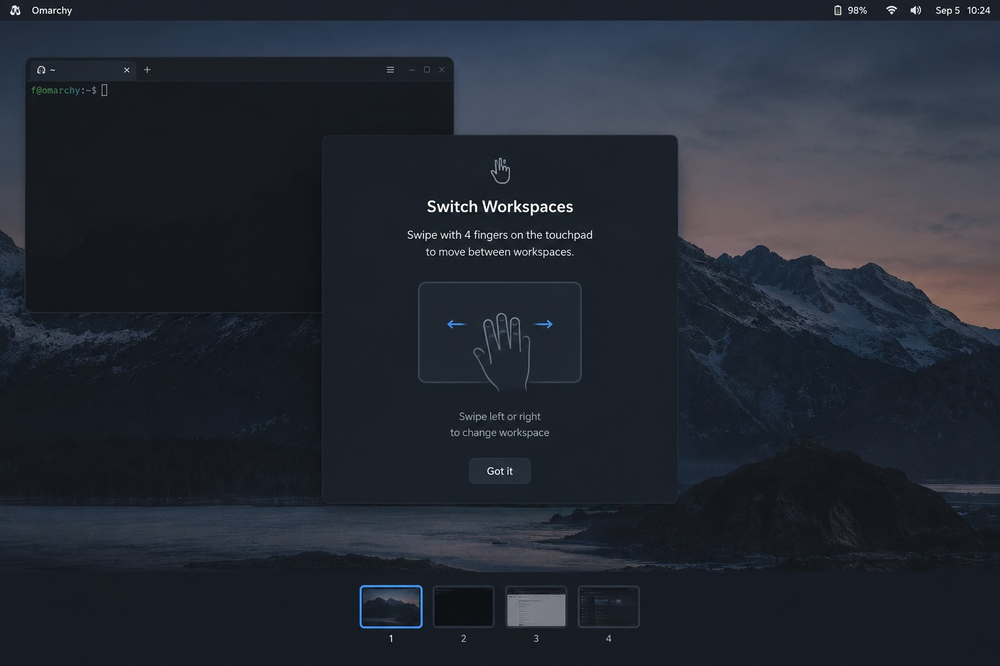

# TouchFlow

Four-finger touchpad gestures that move windows across workspaces and smart-jump
between occupied workspaces — wrapped in a single, tiny Omarchy IPC service.



> `nagualcode.touchflow` — Plugin ID
> `omarchy-shell touchflow <cmd>` — IPC

## What it does

Swipe with four fingers and TouchFlow decides what happens based on your live
Hyprland workspace state — no old-style Lua + bash scripting, no round-tripping
through `hyprctl | jq`. The gesture lives in Hyprland's `input.lua`; the
decisions live in one QML service that reads the Hyprland object model directly.

| Gesture | Empty workspace / no window | Multiple windows | Single window |
| --- | --- | --- | --- |
| **Up** | Opens the browser | Moves the active window to the first empty workspace (or a fresh one) | Moves to the next workspace, **only** if it is occupied |
| **Down** | Opens the terminal (`foot`) | Moves the active window one workspace to the left | Same |
| **Left** | — | Jumps to the next occupied workspace, skipping empty holes | Same, guaranteeing a fresh workspace right after the last used one |
| **Right** | — | Same, in the opposite direction | Same |

Fine details:

- A lone-window **up** swipe only moves if the neighbor on the right is
  occupied; if the neighbor is empty, nothing moves.
- A **down** swipe from workspace 1 does nothing — there is no workspace 0.
- **Side** swipes always skip empty holes, and a new workspace is minted right
  after the last used one, ready for window drops.

## Installation

## 📦 Installation

omarchy plugin add https://github.com/nagualcode/omarchy-touchflow.git --enable

omarchy restart shell

```sh
omarchy restart shell
```

## Removal
omarchy plugin remove nagualcode.touchflow


## Wiring up `input.lua`

The compositor owns the touchpad, so the *gesture itself* stays in Hyprland's
`input.lua` (`~/.config/hypr/input.lua`). Delete any old four-finger Lua block
(`navigate_skipping_empty`, the four `hl.gesture`s pointing at scripts) and
replace it with this:

```lua
-- TouchFlow: the gesture just wakes the plugin; the decision lives inside.
hl.gesture({
  fingers = 4,
  direction = "left",
  action = function() hl.exec_cmd("omarchy-shell touchflow next") end,
})

hl.gesture({
  fingers = 4,
  direction = "right",
  action = function() hl.exec_cmd("omarchy-shell touchflow prev") end,
})

hl.gesture({
  fingers = 4,
  direction = "up",
  action = function() hl.exec_cmd("omarchy-shell touchflow up") end,
})

hl.gesture({
  fingers = 4,
  direction = "down",
  action = function() hl.exec_cmd("omarchy-shell touchflow down") end,
})
```

That's it: from dozens of Lua lines plus two scripts down to four gestures that
phone the plugin.

## IPC: works from anywhere

You don't need a gesture — call TouchFlow from a keybinding, the bar, or a
script:

```sh
omarchy-shell touchflow up      # act as an up swipe
omarchy-shell touchflow down    # act as a down swipe
omarchy-shell touchflow next    # jump to the next occupied workspace
omarchy-shell touchflow prev    # jump to the previous one
omarchy-shell touchflow state   # quick diagnostic
```

## Dependencies

- **Omarchy** (shell + `omarchy-shell` IPC)
- **Hyprland** (gestures, Lua dispatcher)
- A four-finger-trackpad-capable touchpad

## Development

The plugin source lives in `~/.config/omarchy/plugins/nagualcode.touchflow/`:

- `Touchflow.qml` — the whole service (dispatch, fallbacks, IPC handler)
- `manifest.json` — plugin metadata

## License

MIT — fingers not included.
